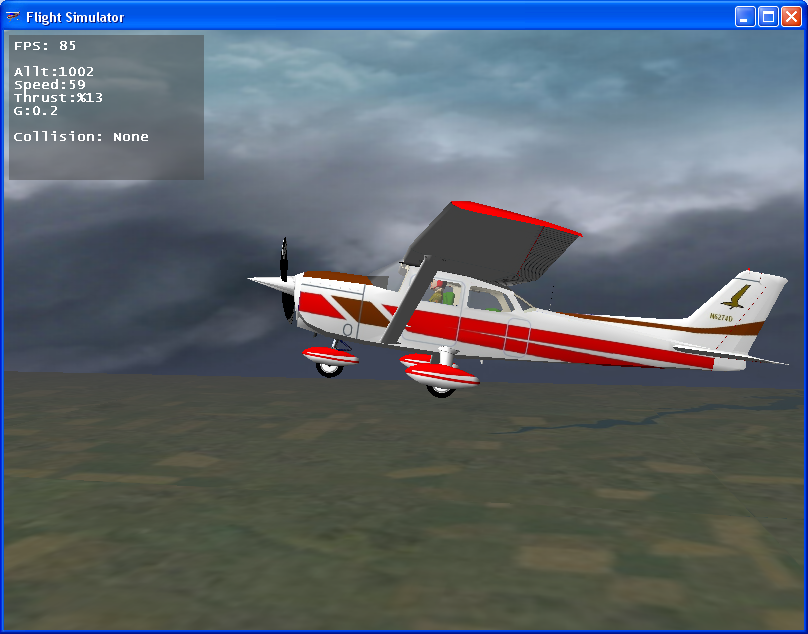

 Introduction
==============

This repository contains my final project to get bachelor's degree in software
engineering from Islamic Azad University of south Tehran branch.

The title of my final project is "Flight Simulator". In this project, I only
focused on aerodynamics forces, flight mechanics, and physics aspects of
simulation of an imaginary aircraft flight. All other aspects of flight
simulation (e.g. terrain rendering, scene management, visual effects and VFX,
weather conditions, sound programming and SFX, networking, and so on) left for
future development.

 Screen shots
==============

